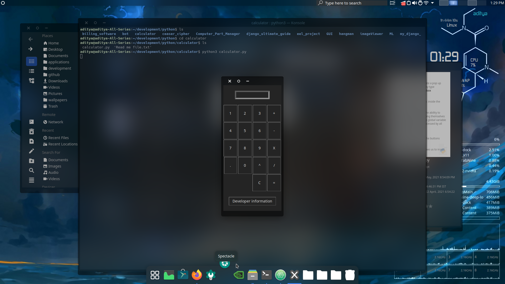
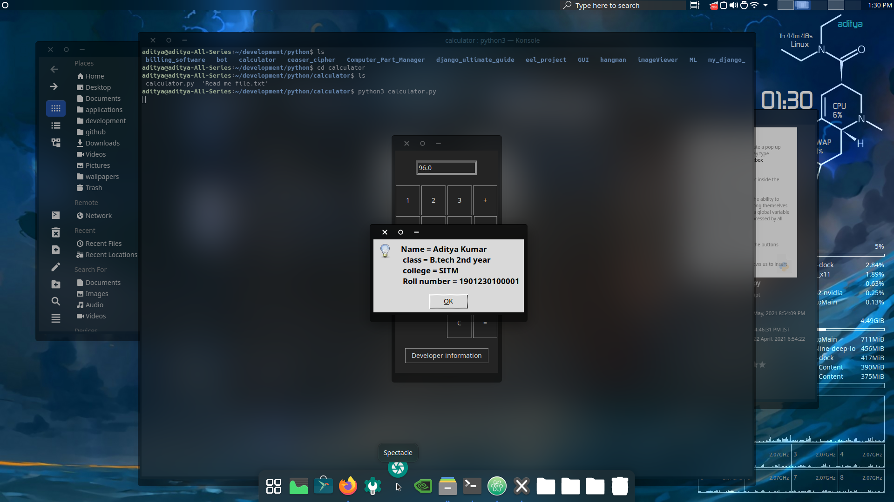

# python-GUI-simple-calculator
this application uses tkinter and python its a very basic calculator
You can download the executable file which runs on a double click from the demo link provided in this repo

NOTE:- 
1. The executables only run on windows
2. Your google chrome browser may prompt you to not keep the file after the download is complete you need to select keep anyway option
3. you may need to run anyway option while running this file for the first time 
4. Feel free to cheeck the source code you have trust issue regarding this app I made

here are some preview images:-

